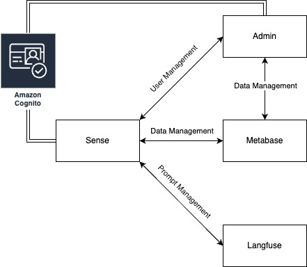

>[!NOTE]
>This is a Proof of Concept (POC) version of Sense. The design prioritizes rapid prototyping and iteration, while balancing security and usability. Each service section includes notes on potential improvements.

# Sense
Welcome to Sense, a data assistant for public service agencies and organisations that sits on your databases.

    

Check out [Sense User Manual](https://transform.gov.sg/blog/20241125-your-guide-to-sense#overview) for more detailed information about Sense.

## Sense High Level Overview
Sense as a whole relies on multiple services to handle user management, data management and prompt management

  

## Running Sense

Setting up a working copy requires setting up several services before Sense can function properly. 

Deployment Options

- [Running Locally with Docker Compose](docs/local/LOCAL_SETUP.md)

- [Cloud Deployment](docs/cloud/DEPLOYMENT.md)

## Contributing

[Development Setup](docs/DEVELOPMENT.md)

[Improvements](docs/IMPROVEMENTS.md)
